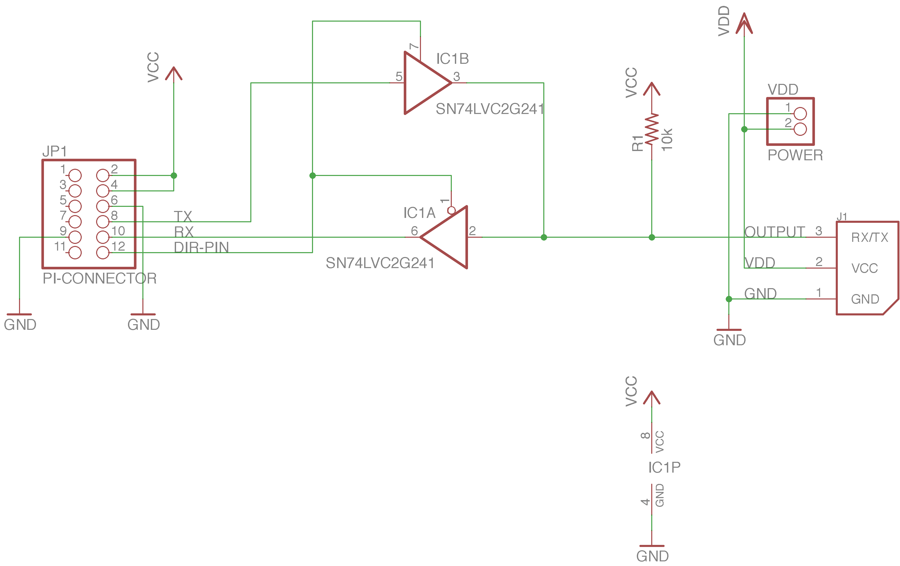
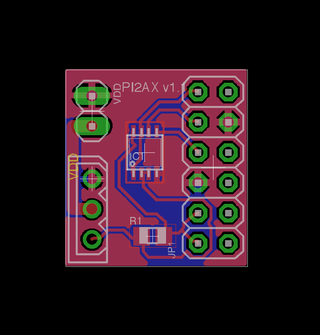
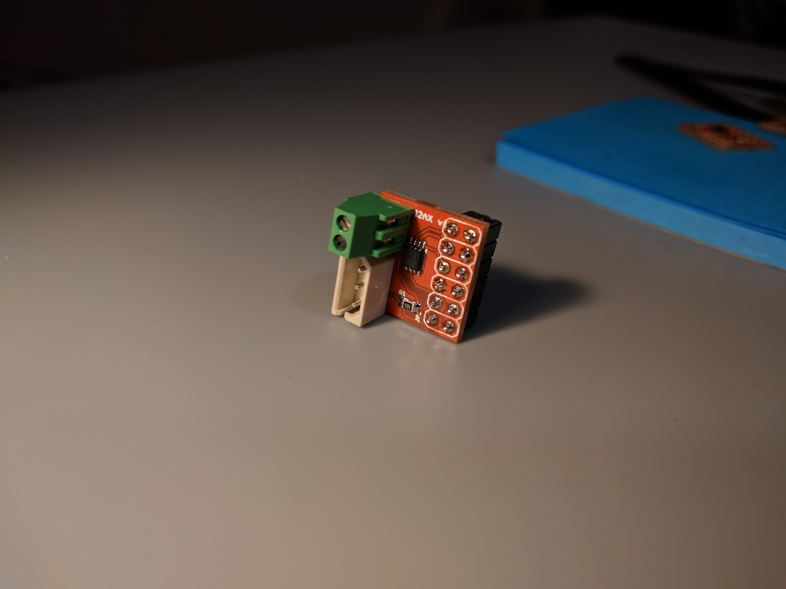
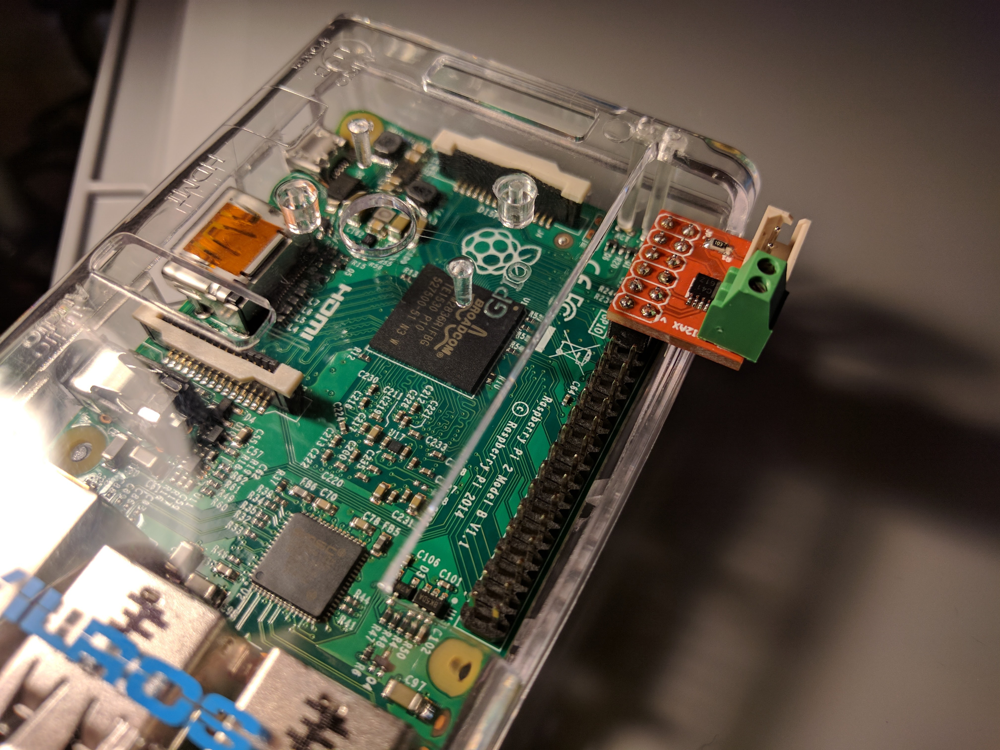

# PI2AX-Board

Little cheap converter for Raspberry PI and Dynamixel Motors based on

[How to drive Dynamixel AX-12A servos (with a RaspberryPi](http://www.instructables.com/id/How-to-drive-Dynamixel-AX-12A-servos-with-a-Raspbe/)

for the project [Memememe](http://memememememememe.me/)

### Components
* [SN74LVC2G241](http://uk.farnell.com/webapp/wcs/stores/servlet/ProductDisplay?catalogId=15001&langId=44&urlRequestType=Base&partNumber=2334889&storeId=10151)
* 10k Resistor [0805](uk.farnell.com/webapp/wcs/stores/servlet/ProductDisplay?catalogId=15001&langId=44&urlRequestType=Base&partNumber=2073612&storeId=10151)
* Molex [SPOX 5267](http://uk.farnell.com/webapp/wcs/stores/servlet/ProductDisplay?catalogId=15001&langId=44&urlRequestType=Base&partNumber=9979620&storeId=10151)
* [Pins Rows](http://uk.farnell.com/webapp/wcs/stores/servlet/ProductDisplay?catalogId=15001&langId=44&urlRequestType=Base&partNumber=1803928&storeId=10151)

## Schematic

[pdf](PI2AX.pdf)

## Board

## Final

